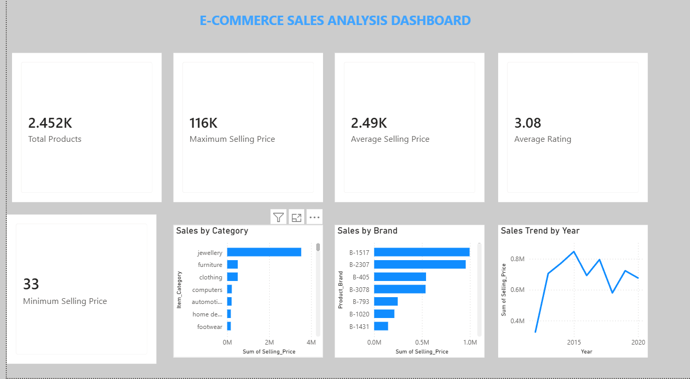

# E-Commerce Sales Analysis

E-Commerce Sales Analysis project using Python, MySQL, Excel and Power BI.

## 📊 Project Overview

This project analyzes e-commerce product data to understand product performance, pricing, ratings, categories and yearly sales trends.

The project includes data analysis using Python and MySQL, data preparation in Excel, and an interactive Power BI dashboard for visualization.

## 🛠️ Tools & Technologies

- Python
- Pandas
- MySQL
- Excel
- Power BI

## 📈 Power BI Dashboard

The dashboard provides an overview of:

- Total Products
- Maximum Selling Price
- Average Selling Price
- Average Rating
- Minimum Selling Price
- Sales by Category
- Sales by Brand
- Sales Trend by Year

## 🖼️ Dashboard Preview

## 📂 Project Files

| File | Description |
|---|---|
| `E-Commerce_Sales_Analysis_PowerBI.pbix` | Power BI dashboard |
| `data_analysis.py` | Python data analysis script |
| `E-Commerce-Sales-Analysis.sql` | MySQL queries |
| `dashboard_screenshot.png` | Dashboard preview |

## 🔍 Key Insights

- The dataset contains 2,452 products.
- Average selling price is approximately ₹2,494.
- Maximum selling price is approximately ₹1.16 lakh.
- Average product rating is 3.08.
- The dashboard compares product performance across categories and brands.
- Year-wise trends help identify changes in selling price over time.

## 🎯 Project Objective

The objective of this project is to demonstrate practical data analysis and business intelligence skills by transforming raw e-commerce data into meaningful insights and an interactive dashboard.

## 👤 Skills Demonstrated

- Data Cleaning
- Data Analysis
- SQL Queries
- Excel Data Handling
- Data Visualization
- Power BI Dashboard Development
- Business Insights
